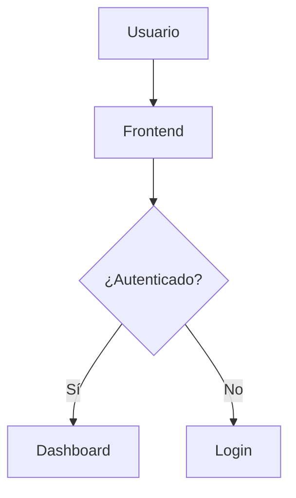
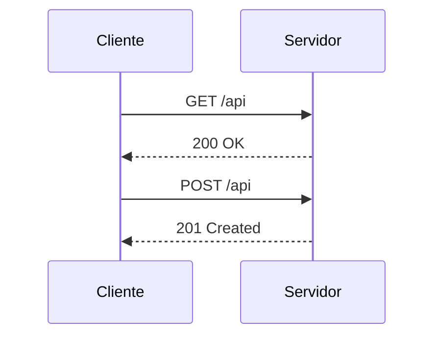
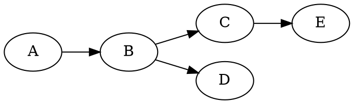
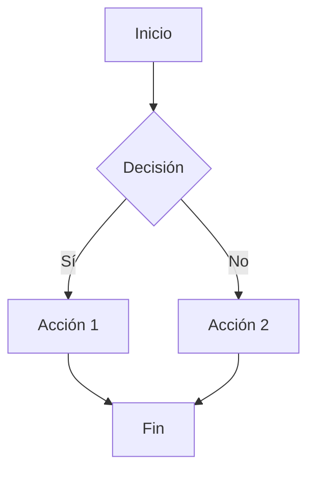
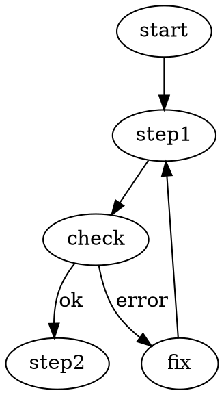

# Diagramas

Página de ejemplo con diagramas Mermaid y DOT (Graphviz) renderizados en el
navegador, junto con bloques de código normales.

## Mermaid — graph TD



## Mermaid — sequenceDiagram



## DOT (Graphviz)



## Múltiples diagramas en la misma página





## Bloques de código normales (no son diagramas)

Los bloques `javascript`, `python`, `bash`, etc. se siguen mostrando como
código normal.

```javascript
function saluda(nombre) {
  return `Hola, ${nombre}!`;
}
```

```python
def saluda(nombre):
    return f"Hola, {nombre}!"
```
