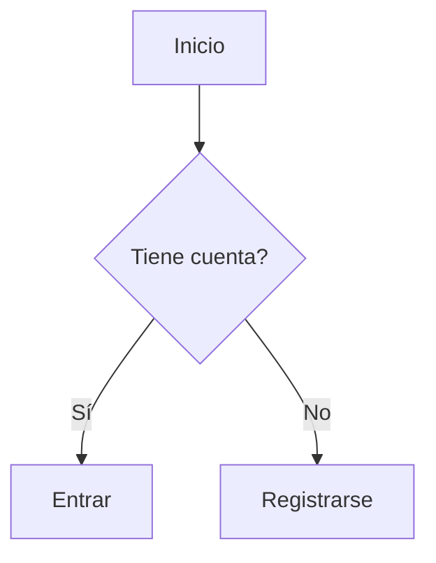
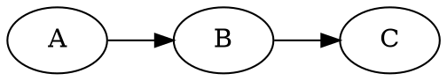

# Estructura de los Markdown

Cada archivo Markdown puede incluir un frontmatter YAML al inicio:

```markdown
---
title: Instalación      # título (si falta, se usa el primer H1)
order: 1                # orden en la navegación
layout: custom          # (opcional) layout distinto
hideNav: false          # (opcional) ocultar del índice
---

# Instalación

Paso 1: instala las dependencias.
```

## Navegación automática

La estructura de carpetas genera el menú:

| Archivo | Ruta generada | Rol |
|---------|---------------|-----|
| `docs/index.md` | `/` | Home. |
| `docs/guia/index.md` | `/guia/` | Título y URL de la sección "Guía". |
| `docs/guia/instalacion.md` | `/guia/instalacion/` | Página dentro de la sección. |

Reglas:

- Las **carpetas** se convierten en **secciones** anidadas.
- Un **`index.md`** dentro de cada carpeta define el título de la sección.
- El **orden** se toma de `order` (si falta, alfabético).
- El **ítem activo** se resalta con la clase `active`.

## Diagramas

Los bloques de código con lenguaje `mermaid` o `dot` (Graphviz) se convierten
automáticamente en diagramas y **no** se muestran como código normal.

### Mermaid

Se renderiza en el navegador. La librería se carga desde CDN **solo** si la
página contiene diagramas Mermaid.



### Dot (Graphviz)

Los diagramas `dot` se renderizan también en el navegador mediante WASM
(la librería se carga solo si hay diagramas DOT) y se sustituyen por SVG.



Los bloques de código de **cualquier otro lenguaje** (por ejemplo `javascript`,
`python`, `bash`) se muestran como código normal.

