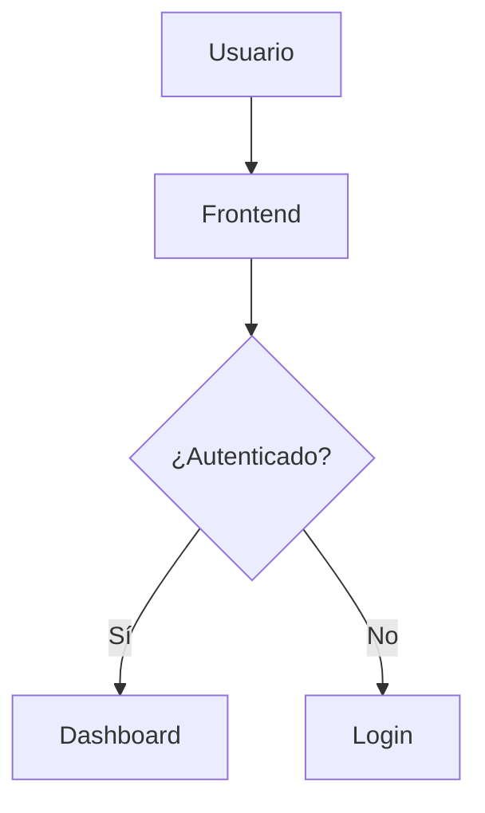
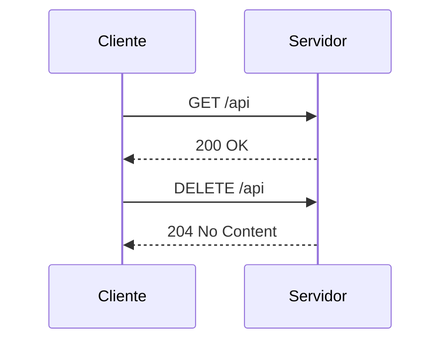
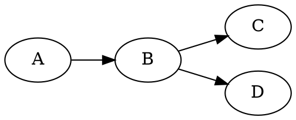
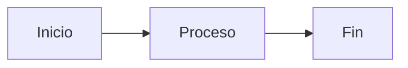
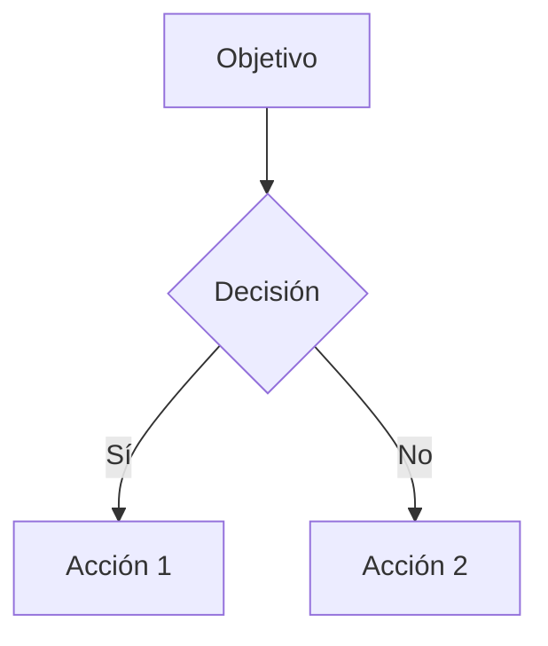
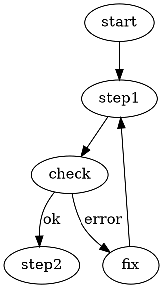

# Diagramas

Esta página verifica la renderización de diagramas Mermaid y Graphviz (DOT) junto con bloques de código normales.

## Mermaid — graph TD



Texto intermedio.

## Mermaid — sequenceDiagram



## DOT (Graphviz)



## Múltiples diagramas en la misma página

Aquí hay dos diagramas Mermaid consecutivos:





Y un DOT al final:



## Bloques de código normales (no diagramas)

Estos deben seguir mostrándose como código.

```javascript
function saluda(nombre) {
  return `Hola, ${nombre}!`;
}
```

```python
def saluda(nombre):
    return f"Hola, {nombre}!"
```
